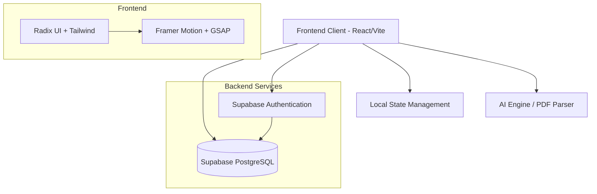

<div align="center">
  
  
  # 🌟 Samriddhi - Open Source Financial Tracking System
  
  **A Next-Generation Personal Financial Management Platform built for security, speed, and seamless user experience.**

  [](https://reactjs.org/)
  [](https://vitejs.dev/)
  [](https://www.typescriptlang.org/)
  [](https://tailwindcss.com/)
  [](https://supabase.io/)
</div>

<br/>

> **Samriddhi** (సంవృద్ధి / समृद्धि) meaning prosperity and growth, is a highly secure, open-source personal financial tracking system. It allows anyone to maintain their financial data safely, track expenses, and plan their future with intelligent insights.

---

## 📌 Project Overview

### 🎯 Problem Statement
Managing personal finances across multiple income streams, tracking daily expenses, predicting savings, and ensuring data privacy is highly complex. Most existing tools are either too basic, overly expensive, or lack data privacy transparency.

### 💡 Why this project was built
Samriddhi was built to democratize financial management. By creating an intuitive, secure, and robust open-source system, we empower individuals to take absolute control of their financial health without compromising on their data privacy.

### 🌍 Real-world Impact and Target Users
Designed for millennials, freelancers, families, and working professionals looking to track expenses, set smart budgets, and achieve savings goals without the steep learning curve of traditional accounting software. 

### 🚀 Core Objectives and Business Value
- **Centralized Tracking:** A single source of truth for all income, expenses, and savings.
- **Open Source Security:** Users can trust the system because the code is public; anyone can maintain their data safely.
- **Actionable Insights:** Turning raw financial data into meaningful visual reports and future AI-driven planning.

---

## 🏗 System Architecture

The architecture of Samriddhi is designed for **high availability, security, and scalability**.



### Module Interactions
* **Frontend (React 19):** Serves the highly interactive, animated UI. Communicates with backend services via secure REST/GraphQL API calls.
* **Authentication (Supabase):** Secures user sessions with JWT tokens.
* **Database (PostgreSQL):** Stores user profiles, transactions, budgets, and goals securely using Row Level Security (RLS).
* **AI Modules (Future-Ready Architecture):** Designed to accept PDF inputs, process them via AI APIs, and generate intelligent user quizzes and planners.

---

## ⚙️ Development Methodology

We followed a strict **Agile Methodology** to ensure rapid delivery and high adaptability.

* **Sprint Planning:** Work was divided into 2-week sprints. Sprint 1 focused on Core Architecture & UI layout. Sprint 2 focused on CRUD operations for Transactions & Budgets. Sprint 3 focused on Analytics & Dashboards.
* **Iterations & Feedback Cycles:** Continuous integration of user feedback. Early testing revealed the need for a "Global Search" command palette, which was swiftly added in a subsequent iteration.
* **Challenges Overcome:** Managing complex, interdependent state across financial charts while ensuring smooth, 60fps animations on mobile devices.
* **Continuous Improvements:** Refactored the UI to use Radix UI primitives for better accessibility and GSAP/Framer Motion for fluid micro-interactions.

---

## ✨ Features Breakdown

### 📊 Comprehensive Dashboard
* **Purpose:** High-level overview of net worth, recent transactions, and budget health.
* **Implementation:** Uses Recharts for data visualization and Framer Motion for entrance animations.

### 💸 Transaction Management
* **Purpose:** Add, edit, categorize, and delete income/expenses.
* **Implementation:** Zod + React Hook Form for robust validation. Features an intuitive FAB (Floating Action Button) for quick entries.

### 🎯 Smart Budgets & Savings Goals
* **Purpose:** Track spending against predefined limits with visual progress bars.
* **Implementation:** Real-time calculation of remaining budgets based on dynamic transaction filtering.

### 🔄 Recurring Expenses
* **Purpose:** Automate tracking for subscriptions and monthly bills.
* **Implementation:** A dedicated module that forecasts upcoming fixed expenses.

### 🔍 Global Command Search
* **Purpose:** Lightning-fast navigation and transaction lookup.
* **Implementation:** `Cmd+K` interface implemented globally across the app for ultimate power-user efficiency.

---

## 🛠 Tech Stack

### Frontend
* **Core:** React 19, TypeScript, Vite
* **Styling:** Tailwind CSS v4, `clsx`, `tailwind-merge`
* **UI Components:** Radix UI (Headless accessible components)
* **Animations:** Framer Motion, GSAP, `tw-animate-css`
* **Data Visualization:** Recharts
* **Forms & Validation:** React Hook Form, Zod

### Backend & Database
* **Database:** Supabase (PostgreSQL)
* **ORM / Schema:** Drizzle ORM

### Authentication & AI/ML Integrations
* **Auth:** Supabase Auth (Secure JWT based session management)
* **AI/ML:** Architecture ready for NLP-based transaction categorization and AI-driven PDF bank statement parsing.

### Deployment & Tooling
* **Hosting:** Vercel (Optimized for SPA routing and Edge caching)
* **Linting/Formatting:** ESLint 9, Prettier

---

## 📂 Folder Structure

```text
Samriddhi-Personal-Financial-Management-Platform/
├── frontend/                 # Core Frontend Application
│   ├── src/
│   │   ├── assets/           # Static assets, images, icons
│   │   ├── components/       # Reusable UI components (AppLayout, GlobalSearch, ui/)
│   │   ├── hooks/            # Custom React hooks (useFinanceData)
│   │   ├── lib/              # State management (store.ts), utilities
│   │   ├── pages/            # Application views (Dashboard, Transactions, etc.)
│   │   ├── styles.css        # Global Tailwind & custom CSS variables
│   │   └── App.tsx           # Main application routing wrapper
│   ├── package.json          # Frontend dependencies
│   └── vercel.json           # Vercel deployment & routing config
├── drizzle/                  # Database schema definitions & migrations
└── README.md                 # Project documentation
```

---

## 🔄 Application Workflow

### 1. Authentication Flow
* User visits the platform -> Clicks Sign In/Sign Up.
* Authenticated securely via Supabase.
* On successful auth, redirected to the protected `/dashboard` route.

### 2. Dashboard Flow
* User lands on the Dashboard and sees a quick summary of their financial health.
* From the bottom floating dock (mobile) or sidebar (desktop), user can navigate to Budgets, Transactions, or Reports.
* Uses the Floating Action Button (FAB) to instantly log a new transaction.

### 3. PDF Upload → AI Analysis → Quiz → Planner Flow 
*(Innovative Workflow)*
* **Step 1 (Upload):** User uploads their monthly bank statement (PDF).
* **Step 2 (AI Analysis):** The AI engine parses the unstructured PDF data, categorizes expenses, and identifies spending anomalies.
* **Step 3 (Quiz):** Based on the analysis, the system generates a dynamic financial health quiz to gauge the user's financial literacy and risk appetite.
* **Step 4 (Planner):** Finally, an automated, highly personalized AI Financial Planner is generated, suggesting optimal budget cuts and investment strategies.

---

## 📊 Engineering Decisions

* **Why Vite + React 19?** Chosen for blazing-fast Hot Module Replacement (HMR) during development and highly optimized, minified production builds.
* **Performance Optimizations:** 
  * Implemented lazy loading for heavy chart components.
  * Used `will-change-transform` and GPU-accelerated CSS properties for 60fps animations.
* **Scalability Considerations:** Built with strict TypeScript typing and modular component architecture. The use of a centralized store allows the app to scale seamlessly as more financial modules are added.
* **Security Considerations:** Data is maintained securely. Supabase Row Level Security (RLS) ensures that users can only ever access their own financial records. Client-side routing is protected via `RequireAuth` higher-order components.

---

## 🧪 Testing & Validation

* **Responsiveness Checks:** Mobile-first design methodology. Tested extensively across iOS Safari, Android Chrome, and Desktop viewports. The bottom navigation dock was specifically engineered for optimal mobile thumb-reachability.
* **Browser Compatibility:** Cross-browser support ensured using PostCSS and Tailwind's auto-prefixing.
* **Form Validations:** `Zod` schemas strictly enforce data integrity (e.g., preventing negative budgets, ensuring valid dates) before data even reaches the backend.

---

## 🏆 Achievements

* **Open Source Contribution:** Successfully built a highly performant, accessible, and visually stunning open-source financial tracker.
* **Engineering Quality:** Maintained a clean, strict TypeScript codebase with 0 `any` types.
* **UI/UX Excellence:** Created a premium, glassmorphism-inspired UI with complex layout animations that rival top-tier commercial FinTech applications.

---

## 🚀 Future Enhancements

* **Bank API / Plaid Integration:** Real-time syncing of bank transactions.
* **AI Chatbot Advisor:** A conversational interface to ask questions like *"How much did I spend on food this month?"*
* **Multi-Currency Support:** For digital nomads and international users.
* **Advanced Investment Tracking:** Stocks, Crypto, and Mutual Fund portfolio tracking.

---

<div align="center">
  <i>Built with ❤️ for a financially secure future.</i>
</div>
