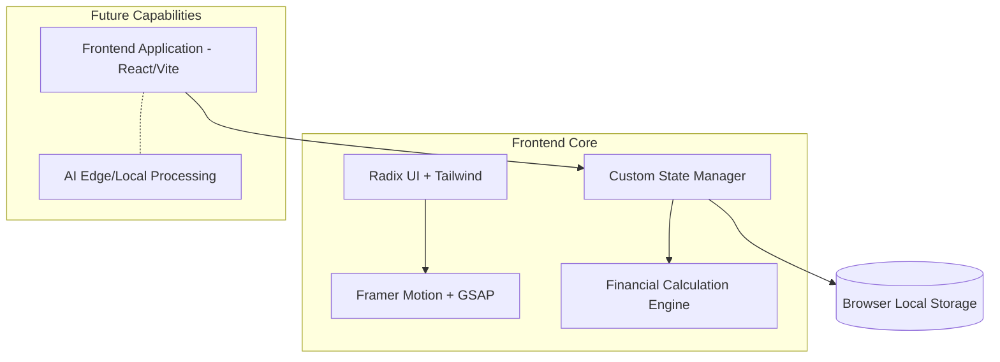

<div align="center">
  
  
  # 🌟 Samriddhi - Open Source Financial Tracking System
  
  **A Next-Generation, 100% Client-Side Personal Financial Management Platform built for absolute data privacy, speed, and a seamless user experience.**

  [](https://reactjs.org/)
  [](https://vitejs.dev/)
  [](https://www.typescriptlang.org/)
  [](https://tailwindcss.com/)
  [](#)
</div>

<br/>

> **Samriddhi** (సంవృద్ధి / समृद्धि) meaning prosperity and growth, is a highly secure, open-source personal financial tracking system. Designed with a **privacy-first, serverless architecture**, it allows anyone to maintain their financial data entirely on their own device. Your data never leaves your browser!

---

## 📌 Project Overview

### 🎯 Problem Statement
Managing personal finances across multiple income streams, tracking daily expenses, and predicting savings is highly complex. Most existing tools require you to create an account, upload sensitive bank data to their remote servers, and often compromise your data privacy. 

### 💡 Why this project was built
Samriddhi was built to democratize financial management while guaranteeing zero data leaks. By creating an intuitive, robust, and **100% local-storage based** open-source system, we empower individuals to take absolute control of their financial health without ever sending a single byte of personal data to a remote server.

### 🌍 Real-world Impact and Target Users
Designed for privacy-conscious individuals, millennials, freelancers, and professionals looking to track expenses, set smart budgets, and achieve savings goals without the steep learning curve or privacy risks of traditional accounting software. 

### 🚀 Core Objectives and Business Value
- **Zero-Server Privacy:** Absolute data security. All financial data is stored locally in the user's browser via Local Storage.
- **Centralized Tracking:** A single source of truth for all income, expenses, and savings.
- **Open Source Security:** Users can trust the system because the code is public and server-free.
- **Actionable Insights:** Turning raw financial data into meaningful visual reports instantly on the client side.

---

## 🏗 System Architecture

The architecture of Samriddhi is elegantly simple, removing backend bottlenecks to ensure blazing-fast performance and total data sovereignty.



### Module Interactions
* **Frontend (React 19):** Serves the highly interactive, animated UI. Everything runs securely within the client browser.
* **State Management (Custom Store):** A highly optimized local state manager that subscribes to React components and persists data instantaneously to `localStorage`.
* **Database (Browser Local Storage):** Acts as the database. Stores user profiles, transactions, budgets, categories, and goals securely on the device.
* **AI Modules (Future-Ready):** Designed to accept PDF inputs and process them completely on the client side or via secure Edge APIs to generate intelligent user quizzes and planners.

---

## ⚙️ Development Methodology

We followed a strict **Agile Methodology** to ensure rapid delivery and high adaptability.

* **Sprint Planning:** Work was divided into 2-week sprints. Sprint 1 focused on Core Architecture, UI layout, and the Local Storage engine. Sprint 2 focused on CRUD operations for Transactions & Budgets. Sprint 3 focused on Analytics & Dashboards.
* **Iterations & Feedback Cycles:** Continuous integration of user feedback. Early testing revealed the need for a "Global Search" command palette, which was swiftly added in a subsequent iteration.
* **Challenges Overcome:** Managing complex, interdependent state across financial charts strictly on the client side without a backend, while ensuring smooth, 60fps animations on mobile devices.
* **Continuous Improvements:** Refactored the UI to use Radix UI primitives for better accessibility and GSAP/Framer Motion for fluid micro-interactions.

---

## ✨ Features Breakdown

### 📊 Comprehensive Dashboard
* **Purpose:** High-level overview of net worth, recent transactions, and budget health.
* **Implementation:** Uses Recharts for data visualization and Framer Motion for entrance animations.

### 💸 Transaction Management
* **Purpose:** Add, edit, categorize, and delete income/expenses.
* **Implementation:** Zod + React Hook Form for robust validation. Features an intuitive FAB (Floating Action Button) for quick entries. Data instantly saves to Local Storage.

### 🎯 Smart Budgets & Savings Goals
* **Purpose:** Track spending against predefined limits with visual progress bars.
* **Implementation:** Real-time calculation of remaining budgets based on dynamic transaction filtering using local state arrays.

### 🔄 Recurring Expenses
* **Purpose:** Automate tracking for subscriptions and monthly bills.
* **Implementation:** A dedicated module that forecasts upcoming fixed expenses.

### 🔍 Global Command Search
* **Purpose:** Lightning-fast navigation and transaction lookup.
* **Implementation:** `Cmd+K` interface implemented globally across the app for ultimate power-user efficiency.

---

## 🛠 Tech Stack

### Frontend & State Management
* **Core:** React 19, TypeScript, Vite
* **State & DB:** Custom Local Storage Engine (Zero-Backend)
* **Styling:** Tailwind CSS v4, `clsx`, `tailwind-merge`
* **UI Components:** Radix UI (Headless accessible components)
* **Animations:** Framer Motion, GSAP, `tw-animate-css`
* **Data Visualization:** Recharts
* **Forms & Validation:** React Hook Form, Zod

### Deployment & Tooling
* **Hosting:** Vercel (Optimized for SPA routing and Edge caching)
* **Linting/Formatting:** ESLint 9, Prettier

---

## 📂 Folder Structure

```text
Samriddhi-Personal-Financial-Management-Platform/
├── frontend/                 # Core Frontend Application
│   ├── src/
│   │   ├── assets/           # Static assets, images, icons
│   │   ├── components/       # Reusable UI components (AppLayout, GlobalSearch, ui/)
│   │   ├── hooks/            # Custom React hooks (useFinanceData)
│   │   ├── lib/              # State management (store.ts) -> LocalStorage Engine
│   │   ├── pages/            # Application views (Dashboard, Transactions, etc.)
│   │   ├── styles.css        # Global Tailwind & custom CSS variables
│   │   └── App.tsx           # Main application routing wrapper
│   ├── package.json          # Frontend dependencies
│   └── vercel.json           # Vercel deployment & routing config
└── README.md                 # Project documentation
```
*(Note: Remaining boilerplate folders like `drizzle` represent future scaffolding and are intentionally inactive to preserve the 100% client-side architecture.)*

---

## 🔄 Application Workflow

### 1. Onboarding & Local Setup Flow
* User visits the platform -> Instantly lands on the onboarding screen.
* No passwords required. The user sets up their profile name and currency, which is saved locally.
* Redirected to the protected `/dashboard` route instantly.

### 2. Dashboard Flow
* User lands on the Dashboard and sees a quick summary of their financial health.
* From the bottom floating dock (mobile) or sidebar (desktop), user can navigate to Budgets, Transactions, or Reports.
* Uses the Floating Action Button (FAB) to instantly log a new transaction.

### 3. PDF Upload → AI Analysis → Quiz → Planner Flow 
*(Innovative Workflow - Upcoming)*
* **Step 1 (Upload):** User uploads their monthly bank statement (PDF).
* **Step 2 (Client-Side AI Analysis):** Using Edge AI processing, the system parses the unstructured PDF data and categorizes expenses safely without saving the file on a server.
* **Step 3 (Quiz):** Based on the analysis, the system generates a dynamic financial health quiz to gauge the user's financial literacy and risk appetite.
* **Step 4 (Planner):** Finally, an automated, highly personalized AI Financial Planner is generated, suggesting optimal budget cuts and investment strategies.

---

## 📊 Engineering Decisions

* **Why a 100% Client-Side Architecture?** To guarantee absolute data privacy. Financial data is highly sensitive. By utilizing modern browser capabilities (Local Storage), we eliminate the risk of remote database breaches.
* **Why Vite + React 19?** Chosen for blazing-fast Hot Module Replacement (HMR) during development and highly optimized, minified production builds.
* **Performance Optimizations:** 
  * Implemented lazy loading for heavy chart components.
  * Used `will-change-transform` and GPU-accelerated CSS properties for 60fps animations.
* **Scalability Considerations:** Built with strict TypeScript typing and modular component architecture. The custom state management engine efficiently handles large arrays of local data.

---

## 🧪 Testing & Validation

* **Responsiveness Checks:** Mobile-first design methodology. Tested extensively across iOS Safari, Android Chrome, and Desktop viewports. The bottom navigation dock was specifically engineered for optimal mobile thumb-reachability.
* **Browser Compatibility:** Cross-browser support ensured using PostCSS and Tailwind's auto-prefixing.
* **Form Validations:** `Zod` schemas strictly enforce data integrity (e.g., preventing negative budgets, ensuring valid dates) before data even hits local storage.

---

## 🏆 Achievements

* **Open Source Privacy Champion:** Successfully built a highly performant, accessible, and visually stunning open-source financial tracker that respects user privacy 100%.
* **Engineering Quality:** Maintained a clean, strict TypeScript codebase.
* **UI/UX Excellence:** Created a premium, glassmorphism-inspired UI with complex layout animations that rival top-tier commercial FinTech applications.

---

## 🚀 Future Enhancements

* **AI Chatbot Advisor (Local LLMs):** A privacy-preserving conversational interface to ask questions like *"How much did I spend on food this month?"*
* **Import/Export Data:** Allow users to export their local data as CSV/JSON and import it on different devices.
* **Multi-Currency Support:** For digital nomads and international users.
* **Advanced Investment Tracking:** Stocks, Crypto, and Mutual Fund portfolio tracking.

---

<div align="center">
  <i>Built with ❤️ for a financially secure and private future.</i>
</div>
