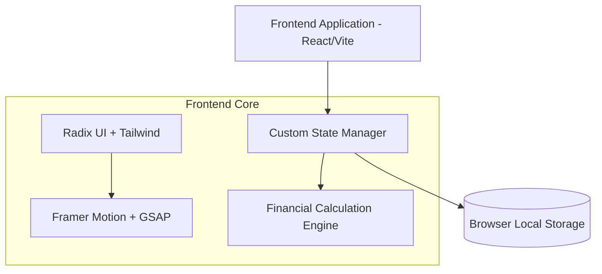

<div align="center">
  
  
  # 🌟 Samriddhi - Personal Finance Notes
  
  **A simple, privacy-focused web tool for manually recording and organizing your personal financial information.**

  [](https://reactjs.org/)
  [](https://vitejs.dev/)
  [](https://www.typescriptlang.org/)
  [](https://tailwindcss.com/)
  [](#)
</div>

<br/>

> **Samriddhi** (సంవృద్ధి / समृद्धि) meaning prosperity and growth, is a highly secure, privacy-first personal financial note-taking system. The application is designed for manual financial organization without requiring financial-account connections or automatic transaction tracking. Your data never leaves your browser!

---

## 📌 Project Overview

### 🎯 What This Website Does
This website allows you to manually record financial information for your own reference, including:
* 💰 Income and financial notes
* 💳 Expenses
* 📊 Budget planning
* 💵 Savings
* 📝 General financial notes
* 🎯 Personal financial goals

The purpose of this website is to provide a simple place to **record, organize, and review financial information manually**.

### 💡 What This Website Is Not
This is **not a financial tracking or monitoring service**.
It does not:
* Track your bank accounts
* Connect to banks or financial institutions
* Monitor transactions
* Automatically collect financial activity
* Track your spending outside the information you manually enter
* Provide investment or financial advice

It is simply a **personal financial note-taking and budgeting tool**.

### 🔒 Local Browser Storage & Privacy
Privacy is a core principle of this project. All financial information you record is stored locally in your browser using **browser local storage**. 

Because the data is stored locally:
* Clearing your browser's site data may remove your records.
* Switching to another browser or device will not automatically transfer your records.
* Private/incognito browsing may have different storage behavior.
* You are responsible for maintaining your own backup of important information.

**Do not enter highly sensitive information** such as bank passwords, credit/debit card numbers, PINs, authentication codes, or Social Security numbers.

---

## 🏗 System Architecture

The architecture of Samriddhi is elegantly simple, removing backend dependencies to ensure privacy and total data sovereignty.



### Module Interactions
* **Frontend (React 19):** Serves the highly interactive UI. Everything runs securely within the client browser.
* **State Management (Custom Store):** A highly optimized local state manager that subscribes to React components and persists data instantaneously to `localStorage`.
* **Database (Browser Local Storage):** Acts as the database. Stores your notes, manual transactions, and goals securely on the device.

---

## ✨ Features Breakdown

### 📊 Simple Dashboard
* **Purpose:** High-level overview of manually entered financial notes and budget health.
* **Implementation:** Uses Recharts for basic data visualization entirely on the client side.

### 💸 Manual Note Management
* **Purpose:** Add, edit, categorize, and delete income/expenses manually.
* **Implementation:** Zod + React Hook Form for robust validation. Data instantly saves to Local Storage.

### 🎯 Manual Budgets & Savings Goals
* **Purpose:** Keep a simple personal budget and track savings manually.
* **Implementation:** Visual progress bars based purely on user-entered data.

### 🔍 Global Command Search
* **Purpose:** Fast navigation and note lookup.
* **Implementation:** `Cmd+K` interface implemented globally across the app for efficiency.

---

## 🛠 Tech Stack

### Frontend & State Management
* **Core:** React 19, TypeScript, Vite
* **State & DB:** Custom Local Storage Engine (Zero-Backend)
* **Styling:** Tailwind CSS v4, `clsx`, `tailwind-merge`
* **UI Components:** Radix UI (Headless accessible components)
* **Animations:** Framer Motion, GSAP
* **Data Visualization:** Recharts
* **Forms & Validation:** React Hook Form, Zod

### Deployment & Tooling
* **Hosting:** Vercel (Optimized for SPA routing)
* **Linting/Formatting:** ESLint 9, Prettier

---

## 📂 Folder Structure

```text
Samriddhi-Personal-Financial-Management-Platform/
├── frontend/                 # Core Frontend Application
│   ├── src/
│   │   ├── assets/           # Static assets, images, icons
│   │   ├── components/       # Reusable UI components
│   │   ├── hooks/            # Custom React hooks
│   │   ├── lib/              # State management (store.ts) -> LocalStorage Engine
│   │   ├── pages/            # Application views (Dashboard, etc.)
│   │   ├── styles.css        # Global Tailwind & custom CSS variables
│   │   └── App.tsx           # Main application routing wrapper
│   ├── package.json          # Frontend dependencies
│   └── vercel.json           # Vercel deployment config
└── README.md                 # Project documentation
```

---

## ⚠️ Disclaimer
This tool is provided for personal organization and record-keeping purposes only. It does not provide financial, investment, tax, legal, or accounting advice. Always verify important financial information independently.

---

<div align="center">
  <i>Built with ❤️ for a secure and private approach to financial organization.</i>
</div>
